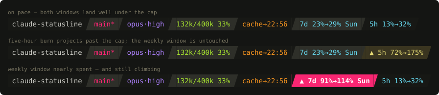

# claude-statusline

[](https://github.com/jasonm4130/claude-statusline/actions/workflows/ci.yml)
[](https://github.com/jasonm4130/claude-statusline/releases)
[](go.mod)
[](LICENSE)

A status line for [Claude Code](https://claude.com/claude-code) that tells you how hard you can spend, not just how much you have spent. It reads the statusline JSON payload on stdin, writes one ANSI-coloured line to stdout, and always exits 0. Go standard library only, no configuration file, no dependencies.



The rate-limit segments project each window forward to its reset. `5h 13%→32%` means the current burn ends the five-hour window at 32% — spend freely. `▲ 5h 72%→175%` means the cap arrives before the reset does.

## Install

Download a binary from [the latest release](https://github.com/jasonm4130/claude-statusline/releases/latest):

```sh
tar -xzf claude-statusline_*_darwin_arm64.tar.gz
install -m 755 claude-statusline_*/claude-statusline ~/.local/bin/
```

Or build from source, which needs nothing but a Go toolchain:

```sh
go install github.com/jasonm4130/claude-statusline@latest
```

## Configure

Point `~/.claude/settings.json` at the binary:

```json
"statusLine": { "type": "command", "command": "~/.local/bin/claude-statusline" }
```

Segment separators use the powerline glyph U+E0BC, so the terminal needs a [Nerd Font](https://www.nerdfonts.com). Colours are 24-bit truecolor.

The context segment measures usage against the auto-compact window rather than the raw context size, because auto-compact is the limit you actually hit. It resolves `CLAUDE_CODE_AUTO_COMPACT_WINDOW` if set, then `autoCompactWindow` from `~/.claude/settings.json`, then falls back to the model's context window size.

## Segments

Each segment disappears when its data is absent, and the alternating backgrounds re-alternate around the gap, so a missing segment never leaves two same-coloured neighbours touching. If stdin cannot be parsed at all, the line degrades to the basename of `$PWD` rather than blanking.

| Segment | Example | Source |
|---|---|---|
| directory | `claude-statusline` | payload `workspace.current_dir`, then `cwd`, then `$PWD` on a parse failure |
| git | `main*` | `.git/HEAD` read directly; `*` from `git status --porcelain` |
| model | `opus·high` | payload `model` and `effort` |
| context | `132k/400k 33%` | payload `context_window` against the auto-compact window |
| cache | `cache→22:56` | prompt-cache expiry, parsed from the transcript |
| weekly limit | `7d 23%→29% Sun` | payload `rate_limits.seven_day` |
| session limit | `5h 13%→32%` | payload `rate_limits.five_hour` |

## Design notes

Claude Code runs the statusline command on state change, never on a timer. Measured idle, it goes 60 seconds or more between invocations. Everything on the line therefore has to stay **true while frozen**, and that single constraint drives most of the decisions below.

### Rate-limit pace

Each window has a known length, so `resets_at` fixes its start and the fraction already elapsed is arithmetic. Dividing used percent by that fraction projects where the window lands at reset if the average burn so far continues. Under 100% is headroom. At or over 100% the segment warms and takes a `▲`, because the cap will arrive before the reset does.

Two things follow from the definition, and both matter when reading the number. The projection is a **cumulative average**, so it has no memory of shape: a window where you burned 40% in twenty minutes and one where you dripped 40% across three hours project identically. And `used_percentage` is the server's figure, from the claude.ai usage endpoint, so the unit is percent of quota rather than tokens — already weighted for model, cache, and everything else the server weighs, and counting your usage on other machines too.

Freezing is safe here, which is why the projection is allowed on the line at all. While a session sits idle, elapsed grows and used does not, so the true projection only ever falls. A stale reading overstates the burn and can never invite spend the window cannot cover.

The projection is suppressed below 5% elapsed, where used-over-elapsed is dominated by whatever landed in the first few minutes, and whenever `resets_at` is missing or already past. Those cases fall back to bare usage.

Each window renders as its own segment so that it can carry its own colour. A hot five-hour window should not repaint a healthy weekly one.

### Prompt-cache expiry

The cache segment shows an absolute clock time rather than a countdown. A countdown, or a warm/expired badge, freezes mid-session and quietly becomes a lie — exactly when a quiet session is when you want to know. `cache→22:56` is still true at 23:30, because the arithmetic happened once and does not decay. The one claim safe to render is the negative one, so once the clock has passed, the segment reads `cache cold` and stays honest: expiry only moves forward when a new request lands, and a new request re-renders.

Both inputs come from the `transcript_path` the payload already supplies. The timestamp is the newest request's, since a cache read refreshes the entry's TTL. The tier is the newest request that actually wrote a cache entry, read from `message.usage.cache_creation` — `ephemeral_1h_input_tokens` against `ephemeral_5m_input_tokens` — so the TTL is measured, never assumed. Only the last 512 KB of the transcript is read, from the end, with the partial first line dropped.

### Latency

Nothing on the line is allowed to make the prompt wait. The git branch comes from reading `.git/HEAD` directly rather than shelling out. The dirty marker is the one subprocess, and it runs under a 150 ms timeout and is dropped rather than waited on.

## Palette

Theme: Cyber-Monokai, 24-bit truecolor. Backgrounds alternate between `#171815` and `#2E2F29` by render position among the segments actually present; each segment's identity lives in its text colour.

| Segment | Colour |
|---|---|
| directory | `#C8C8C2` |
| git | `#F92672` |
| model | `#AE81FF` |
| context | `#A6E22E` |
| cache | `#FD971F` |
| limits | `#66D9EF` |

The directory segment is the exception to identity-as-text-colour: its text is `#C8C8C2`, while `#75715E` serves as its muted accent.

Context and rate-limit segments each key on their own percentage. From 60% to 84% a segment goes warming — background `#3A3520`, text `#E6DB74`. At 85% and above it goes critical: background `#F92672` flooded with bold `#FFFFFF`. A cold cache borrows the warming style. Where two adjacent segments share a state, and therefore a background, the separator between them darkens to `#2A2618` or `#C71F5B` to keep its shape visible.

A projection past 100% warms a segment and adds `▲`. The glyph is not decoration: warming amber also means "used a lot", the two conditions are different, and a glyph survives a colourblind reader and a terminal with a mangled palette.

## Development

```sh
go test ./...              # unit tests and the demo-image golden check
golangci-lint run ./...
goreleaser release --snapshot --skip=publish --clean
```

The demo image at the top of this README is generated from real render output, not drawn by hand. `TestDemoSVG` builds sample payloads, runs them through the same `draw()` the terminal gets, parses that ANSI back into coloured runs, and emits SVG. CI regenerates it and fails on any diff, so a palette or layout change cannot ship alongside a screenshot that no longer matches what the binary prints.

```sh
go test -run TestDemoSVG -update .    # after an intentional visual change
```

Releases are tag-driven. Pushing a `v*` tag builds four binaries (darwin and linux, amd64 and arm64), attaches checksums and per-archive SBOMs, and publishes a GitHub release.

## License

[MIT](LICENSE)
